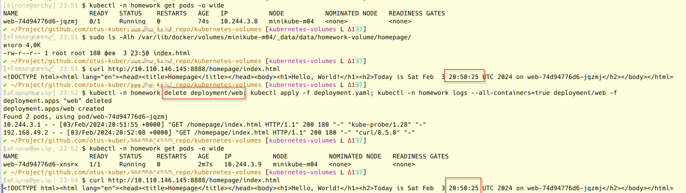
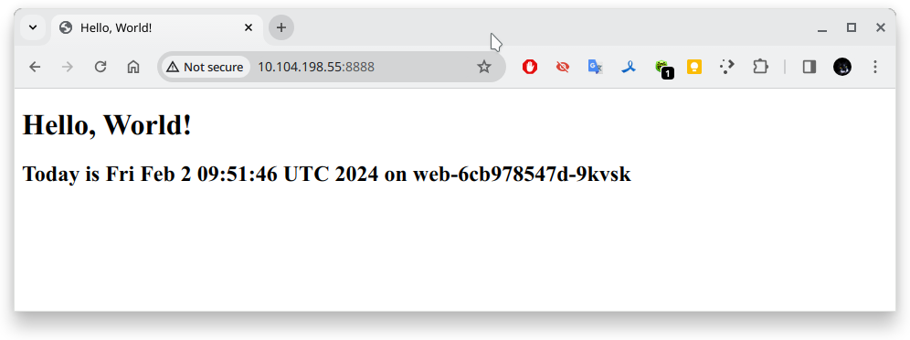
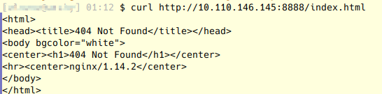
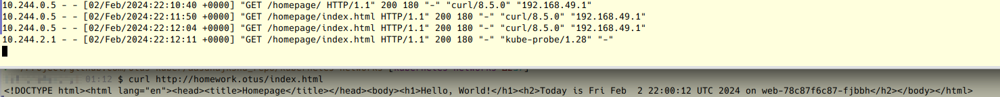

# Репозиторий для выполнения домашних заданий курса "Инфраструктурная платформа на основе Kubernetes-2023-12"

aasdhajkshd repository

> <span style="color:red">INFO</span>
<span style="color:blue">Информация на картинках, как IP адреса, порты или время, может отличаться от приводимой в тексте.</span>

> [Шпаргалка по kubectl](https://kubernetes.io/ru/docs/reference/kubectl/cheatsheet/)

---

## Содержание

* [Знакомство с Kubernetes, основные понятия и архитектура](#kubernetes-intro)
* [Управление жизненным циклом и взаимодействием pod в Kubernetes](#kubernetes-controllers)
* [Сетевая подсистема и сущности Kubernetes](#kubernetes-networks)
* [Хранение данных в Kubernetes: Volumes, Storages, Statefull-приложения](#kubernetes-volumes)

---

## <a name="kubernetes-volumes">Хранение данных в Kubernetes: Volumes, Storages, Statefull-приложения</a>

### ДЗ // Volumes, StorageClass, PV, PVC

#### Выполнение

1. Активированы дополнительные [плагины](https://minikube.sigs.k8s.io/docs/tutorials/volume_snapshots_and_csi/) для minikube'а
  
```bash
# minikube start --node=3 --network-plugin=cni --enable-default-cni --container-runtime=containerd --bootstrapper=kubeadm

$ minikube addons enable volumesnapshots
...
  The 'volumesnapshots' addon is enabled

$ minikube addons enable csi-hostpath-driver
...
  The 'csi-hostpath-driver' addon is enabled
```

1. Создан манифест `kubernetes-volumes/storageClass.yaml` с именем *homework-storage* с provisioner: *hostPath* и reclaimPolicy: *Retain*

```bash
$ kubectl apply -f storageClass.yaml
storageclass.storage.k8s.io/homework-storage created

$ kubectl get sc
NAME                 PROVISIONER                RECLAIMPOLICY   VOLUMEBINDINGMODE      ALLOWVOLUMEEXPANSION   AGE
csi-hostpath-sc      hostpath.csi.k8s.io        Delete          Immediate              false                  6m29s
homework-storage     k8s.io/minikube-hostpath   Retain          WaitForFirstConsumer   true                   11s
standard (default)   k8s.io/minikube-hostpath   Delete          Immediate              false                  17h

$ kubectl describe storageClasses/homework-storage
Name:            homework-storage
IsDefaultClass:  No
Annotations:     kubectl.kubernetes.io/last-applied-configuration={"allowVolumeExpansion":true,"apiVersion":"storage.k8s.io/v1","kind":"StorageClass","metadata":{"annotations":{"storageclass.kubernetes.io/is-default-class":"false"},"labels":{"addonmanager.kubernetes.io/mode":"EnsureExists","name":"homework"},"name":"homework-storage"},"mountOptions":["discard"],"parameters":{"guaranteedReadWriteLatency":"true"},"provisioner":"k8s.io/minikube-hostpath","reclaimPolicy":"Retain","volumeBindingMode":"WaitForFirstConsumer"}
,storageclass.kubernetes.io/is-default-class=false
Provisioner:           k8s.io/minikube-hostpath
Parameters:            guaranteedReadWriteLatency=true
AllowVolumeExpansion:  True
MountOptions:
  discard
ReclaimPolicy:      Retain
VolumeBindingMode:  WaitForFirstConsumer
Events:             <none>
```

2. Созданы манифесты `kubernetes-volumes/pvc.yaml` и `kubernetes-volumes/pv.yaml`, описывающие PersistentVolumeClaim, PersistentVolume с привязкой к `hostPath` в minikube'е, которые используют хранилище с storageClass из 1-го пункта

```bash
$ kubectl apply -f pv.yaml -f pvc.yaml

$ kubectl -n homework get pvc,pv
NAME                                 STATUS   VOLUME        CAPACITY   ACCESS MODES   STORAGECLASS       AGE
persistentvolumeclaim/homework-pvc   Bound    homework-pv   200Mi      RWO            homework-storage   3h33m

NAME                           CAPACITY   ACCESS MODES   RECLAIM POLICY   STATUS   CLAIM                   STORAGECLASS       REASON   AGE
persistentvolume/homework-pv   200Mi      RWO            Retain           Bound    homework/homework-pvc   homework-storage            3h33m
```

3. Создан манифест `kubernetes-volumes/cm.yaml` для объекта типа configMap с *nginx-config-file*, описывающий произвольный набор пар ключ-значение

```bash
$ kubectl -n homework get configmaps/nginx-config-file -o yaml
```
```yaml
apiVersion: v1
data:
  file: property=value
kind: ConfigMap
...
```

4. В манифест `kubernetes-volumes/deployment.yaml` внесены изменения в спецификацию volume на pvc - *homework-pvc*

```bash
$ kubectl -n homework describe deployments.apps/web
```
```yaml
    Mounts:
...
      /homework from homework-volume (rw)
...
  Volumes:
   homework-volume:
    Type:       PersistentVolumeClaim (a reference to a PersistentVolumeClaim in the same namespace)
    ClaimName:  homework-pvc
```

#### Задание с *

1. В манифесте `deployment.yaml` добавлено подключение configMap как volume к основному контейнеру пода в директорию /homework/conf, где можно обратиться к /conf/file

```yaml
    Mounts:
...
      /homework/conf/file from nginx-config-file (rw)
  Volumes:
...
   nginx-config-file:
    Type:      ConfigMap (a volume populated by a ConfigMap)
    Name:      nginx-config-file
```

```bash
$ curl -I http://10.110.146.145:8888/conf/file
HTTP/1.1 301 Moved Permanently
Server: nginx/1.14.2
Date: Sat, 03 Feb 2024 21:28:46 GMT
Content-Type: text/html
Content-Length: 185
Location: http://10.110.146.145:8000/conf/file/
Connection: keep-alive

$ curl http://10.110.146.145:8888/conf/file/..data/file
property=value

```

2. Внесены изменения в манифест `pvc.yaml` так, чтобы в нем запрашивалось хранилище созданного storageClass'а, см. пункт 2.

Для Retain-политики выполнялась проверка с удалением *Deployment/web*, см. изображение ниже. Как видим, файл не удаляется. Здесь спецификация *preStop* с удалением файла index.html была "закомментирована"



#### Список документации:

- [Установка Kubernetes с помощью Minikube](https://kubernetes.io/ru/docs/setup/learning-environment/minikube/)
- [Volumes](https://kubernetes.io/docs/concepts/storage/volumes/)
- [Persistent Volumes](https://kubernetes.io/docs/concepts/storage/persistent-volumes/)
- [Storage Classes](https://kubernetes.io/docs/concepts/storage/storage-classes/)
- [ConfigMaps](https://kubernetes.io/docs/concepts/configuration/configmap/)
- [Configure a Pod to Use a ConfigMap](https://kubernetes.io/docs/tasks/configure-pod-container/configure-pod-configmap/)
- [Learning Kubernetes: persistent storage with Minikube](https://martincarstenbach.wordpress.com/2019/06/07/learning-kubernetes-persistent-storage-with-minikube/)
- [Configure a Pod to Use a PersistentVolume for Storage](https://kubernetes.io/docs/tasks/configure-pod-container/configure-persistent-volume-storage/)

---

## <a name="kubernetes-networks">Сетевая подсистема и сущности Kubernetes</a>

### ДЗ // Сетевое взаимодействие Pod, сервисы

#### Выполнение

1. Скопированы манифесты `kubernetes-networks/namespace.yaml`, `kubernetes-networks/configmap.yaml` и `kubernetes-networks/desployment.yaml`
2. Внесены измения в манифест `deployment.yaml`, чтобы выполнялась проверка по **httpGet**, вызывающую URL /index.html (далее /homepage/index.html)
3. Cоздан манифест `service.yaml`, который описывает сервис типа ClusterIP, который будет направляет трафик на поды *web*, управляемые *Deployment* сервисом
4. Установлен в кластер *minikube* ingress-контроллер nginx

> порты выбраны специально, чтобы наблюдать проходжение запроса

```bash
$ minikube start --nodes=4 
# https://minikube.sigs.k8s.io/docs/tutorials/multi_node/ 
# for i in 3; do minikube node add --delete-on-failure=true --worker=true; done

$ kubectl label nodes --overwrite=true minikube-m02 minikube-m03 workload=production

$ kubectl apply -f namespace.yaml -f configmap.yaml -f deployment.yaml -f service.yaml
...
service/ui configured

$ kubectl -n homework describe service/ui
Name:              ui
Namespace:         homework
Labels:            app=ui
                   component=homework
Annotations:       <none>
Selector:          app=nginx,component=homework
Type:              ClusterIP
IP Family Policy:  SingleStack
IP Families:       IPv4
IP:                10.110.146.145
IPs:               10.110.146.145
Port:              <unset>  8888/TCP
TargetPort:        8000/TCP
Endpoints:         10.244.1.2:8000,10.244.1.3:8000,10.244.2.2:8000
Session Affinity:  None
Events:            <none>

$ kubectl -n homework get svc
NAME   TYPE        CLUSTER-IP       EXTERNAL-IP   PORT(S)    AGE
ui     ClusterIP   10.110.146.145   <none>        8888/TCP   28m

```

Тестирование:

```bash
$ kubectl port-forward -n homework services/ui 8888:8888
```



5. Создан манифест `ingress.yaml`, в котором описывается описан объект типа ingress, направляющий все http запросы к хосту homework.otus на ранее созданный сервис.

```bash
$ minikube addons enable ingress
💡  ingress is an addon maintained by Kubernetes. For any concerns contact minikube on GitHub.
You can view the list of minikube maintainers at: https://github.com/kubernetes/minikube/blob/master/OWNERS
    ▪ Using image registry.k8s.io/ingress-nginx/controller:v1.9.4
    ▪ Using image registry.k8s.io/ingress-nginx/kube-webhook-certgen:v20231011-8b53cabe0
    ▪ Using image registry.k8s.io/ingress-nginx/kube-webhook-certgen:v20231011-8b53cabe0
🔎  Verifying ingress addon...
🌟  The 'ingress' addon is enabled

$ kubectl apply -f ingress.yaml
ingress.networking.k8s.io/ui created

$ kubectl -n homework get ingress
NAME   CLASS   HOSTS           ADDRESS        PORTS   AGE
ui     nginx   homework.otus   192.168.49.2   80      2m36s

$ minikube tunnel
Status:
        machine: minikube
        pid: 1200117
        route: 10.96.0.0/12 -> 192.168.49.2
        minikube: Running
...
```

Проверка:

```bash
$ curl http://homework.otus/
<!DOCTYPE html><html lang="en"><head><title>Hello, World!</title></head><body><h1>Hello, World!</h1><h2>Today is Fri Feb  2 19:31:59 UTC 2024 on web-f7ffc5798-jptjj</h2></body></html>
```

#### Задание со *

Для выполнения задания со \*, где выполняется обращение к *http://homework.otus/index.html*, ingress перенаправляет на *http://homework.otus/homepage* внесены изменения в манифесты, так что запрашиваемая страница доступна по новому адресу service/ClusterIP *http://10.110.146.145:8888/homepage/*

Для проверки при обращении к http://homework.otus/index.html выдается ошибка:



Ingress nginx вносит изменения и страница доступна:



где адрес *192.168.49.2 homework.otus* прописан локальнов в `/etc/hosts`

```bash
$ kubectl -n homework logs deployments/web -f
Found 3 pods, using pod/web-78c87f6c87-fjbbh
...
10.244.0.5 - - [02/Feb/2024:22:10:40 +0000] "GET /homepage/ HTTP/1.1" 200 180 "-" "curl/8.5.0" "192.168.49.1"
10.244.0.5 - - [02/Feb/2024:22:11:50 +0000] "GET /homepage/index.html HTTP/1.1" 200 180 "-" "curl/8.5.0" "192.168.49.1"
10.244.0.5 - - [02/Feb/2024:22:12:04 +0000] "GET /homepage/index.html HTTP/1.1" 200 180 "-" "curl/8.5.0" "192.168.49.1"
```

---

## <a name="kubernetes-controllers">Управление жизненным циклом и взаимодействием pod в Kubernetes</a>

### ДЗ // Kubernetes controllers. ReplicaSet, Deployment, DaemonSet

#### Выполнение

1. Созданы манифесты `kubernetes-controllers/namespace.yaml`, `kubernetes-controllers/configmap.yaml` и `kubernetes-controllers/desployment.yaml`
2. Манифест `deployment.yaml` имеет *kind: Deployment*, запускает 3 экземпляра пода *replicas: 3*.
3. Добавлен readiness probe, которая проверяяет наличие файла /homework/index.html
4. Описынвается стратегия обновления *RollingUpdate*, настроенную так, что в процессе обновления может быть недоступен максимум 1 pod: *maxUnavailable: 1*.

Резлуьтат примения:

```bash
$ export KUBECONFIG=/tmp/kind/.kube/config; kubectl config use-context kind-kind
Switched to context "kind-kind".

$ kubectl config view
apiVersion: v1
clusters:
- cluster:
    certificate-authority-data: DATA+OMITTED
    server: https://127.0.0.1:6443
  name: kind-kind
contexts:
- context:
    cluster: kind-kind
    user: kind-kind
  name: kind-kind
current-context: kind-kind
kind: Config
preferences: {}
users:
- name: kind-kind
  user:
    client-certificate-data: DATA+OMITTED
    client-key-data: DATA+OMITTED

$ k get nodes
NAME                 STATUS   ROLES           AGE   VERSION
kind-control-plane   Ready    control-plane   89m   v1.27.3
kind-worker          Ready    <none>          89m   v1.27.3
kind-worker2         Ready    <none>          89m   v1.27.3
kind-worker3         Ready    <none>          89m   v1.27.3

$ kubectl apply -f namespace.yaml
namespace/homework created
$ kubectl get namespace
NAME                 STATUS   AGE
default              Active   4h44m
homework             Active   9s
kube-node-lease      Active   4h44m
kube-public          Active   4h44m
kube-system          Active   4h44m
local-path-storage   Active   4h44m

$ kubectl apply -f configmap.yaml
configmap/nginx-config-homework created

$ kubectl apply -f deployment.yaml
deployment.apps/web created

$ kubectl -n homework get deployments
NAME   READY   UP-TO-DATE   AVAILABLE   AGE
web    3/3     3            3           99s

$ kubectl -n homework get pods -o wide
NAME                   READY   STATUS    RESTARTS   AGE     IP           NODE           NOMINATED NODE   READINESS GATES
web-7c5d79b5bb-894jg   1/1     Running   0          2m20s   10.244.2.2   kind-worker3   <none>           <none>
web-7c5d79b5bb-92z86   1/1     Running   0          2m20s   10.244.1.2   kind-worker    <none>           <none>
web-7c5d79b5bb-czxpz   1/1     Running   0          2m20s   10.244.3.2   kind-worker2   <none>           <none>

$ kubectl -n homework set image deployment/web nginx=nginx:1.16.1
deployment.apps/web image updated

$ kubectl -n homework edit deployment/web
deployment.apps/web edited

$ kubectl -n homework rollout status deployment/web
Waiting for deployment "web" rollout to finish: 2 out of 3 new replicas have been updated...
Waiting for deployment "web" rollout to finish: 2 out of 3 new replicas have been updated...
Waiting for deployment "web" rollout to finish: 2 out of 3 new replicas have been updated...
Waiting for deployment "web" rollout to finish: 1 old replicas are pending termination...
Waiting for deployment "web" rollout to finish: 1 old replicas are pending termination...
deployment "web" successfully rolled out


$ kubectl -n homework describe deployments.apps/web
Name:                   web
Namespace:              homework
CreationTimestamp:      Thu, 01 Feb 2024 17:03:39 +0300
Labels:                 app=nginx
                        component=homework
Annotations:            deployment.kubernetes.io/revision: 9
Selector:               app=nginx,component=homework
Replicas:               3 desired | 3 updated | 3 total | 3 available | 0 unavailable
StrategyType:           RollingUpdate
MinReadySeconds:        0
RollingUpdateStrategy:  1 max unavailable, 50% max surge
Pod Template:
  Labels:       app=nginx
                component=homework
  Annotations:  kubectl.kubernetes.io/restartedAt: 2024-02-01T17:27:50+03:00
...
    Liveness:   http-get http://:8000/index.html delay=5s timeout=1s period=360s #success=1 #failure=3
    Readiness:  exec [cat /homework/index.html] delay=5s timeout=1s period=30s #success=1 #failure=3
...
```

#### Задание со *

1. Добавление меток *workload* к worker-узлам

```bash
$ kubectl get nodes --show-labels
NAME                 STATUS   ROLES           AGE     VERSION   LABELS
kind-control-plane   Ready    control-plane   6h35m   v1.27.3   ...kubernetes.io/hostname=kind-control-plane,kubernetes.io/os=linux,node-role.kubernetes.io/control-plane=,node.kubernetes.io/exclude-from-external-load-balancers=
kind-worker          Ready    <none>          6h35m   v1.27.3   ...kubernetes.io/hostname=kind-worker,kubernetes.io/os=linux
kind-worker2         Ready    <none>          6h35m   v1.27.3   ...kubernetes.io/hostname=kind-worker2,kubernetes.io/os=linux
kind-worker3         Ready    <none>          6h35m   v1.27.3   ...kubernetes.io/hostname=kind-worker3,kubernetes.io/os=linux

$ kubectl label --list nodes kind-worker3
beta.kubernetes.io/os=linux
kubernetes.io/arch=amd64
kubernetes.io/hostname=kind-worker3
kubernetes.io/os=linux
beta.kubernetes.io/arch=amd64

$ kubectl label nodes kind-worker2 kind-worker3 workload=production
node/kind-worker2 labeled
node/kind-worker3 labeled

$ kubectl label --overwrite=true nodes kind-worker workload=staging
node/kind-worker labeled

$ kubectl get nodes --show-labels
NAME                 STATUS   ROLES           AGE     VERSION   LABELS
...
kind-worker          Ready    <none>          6h38m   v1.27.3   ...workload=staging
kind-worker2         Ready    <none>          6h38m   v1.27.3   ...workload=production
kind-worker3         Ready    <none>          6h38m   v1.27.3   ...workload=production
```

2. Pod'ы запущены равномерно без привязки

```bash
$ kubectl -n homework get pods -o wide
NAME                   READY   STATUS    RESTARTS   AGE   IP           NODE           NOMINATED NODE   READINESS GATES
web-7679b85bf8-c2d7n   1/1     Running   0          43m   10.244.1.8   kind-worker    <none>           <none>
web-7679b85bf8-lhhm9   1/1     Running   0          43m   10.244.2.7   kind-worker3   <none>           <none>
web-7679b85bf8-rkdfw   1/1     Running   0          43m   10.244.3.7   kind-worker2   <none>           <none>
```

3. Изменения в конфигурации манифестов

для `kubernetes-controllers\deployment.yaml`

```yaml
      nodeSelector:
        workload: production
```

для `kubernetes-intro\pod.yaml`

```yaml
      nodeSelector:
        workload: staging
```

```bash
$ kubectl apply -f deployment.yaml
deployment.apps/web configured

```

> Изменение статуса

```bash
$ kubectl -n homework get pods -o wide
NAME                   READY   STATUS            RESTARTS   AGE   IP           NODE           NOMINATED NODE   READINESS GATES
web-566b65f6b7-hfm4k   0/1     Running           0          5s    10.244.2.8   kind-worker3   <none>           <none>
web-566b65f6b7-r5psl   0/1     Running           0          5s    10.244.3.9   kind-worker2   <none>           <none>
web-566b65f6b7-wfzfb   0/1     PodInitializing   0          5s    10.244.3.8   kind-worker2   <none>           <none>
web-7679b85bf8-lhhm9   1/1     Running           0          44m   10.244.2.7   kind-worker3   <none>           <none>
web-7679b85bf8-rkdfw   1/1     Running           0          44m   10.244.3.7   kind-worker2   <none>           <none>

$ kubectl -n homework get pods -o wide
NAME                   READY   STATUS    RESTARTS   AGE   IP           NODE           NOMINATED NODE   READINESS GATES
web-566b65f6b7-hfm4k   1/1     Running   0          73s   10.244.2.8   kind-worker3   <none>           <none>
web-566b65f6b7-r5psl   1/1     Running   0          73s   10.244.3.9   kind-worker2   <none>           <none>
web-566b65f6b7-wfzfb   1/1     Running   0          73s   10.244.3.8   kind-worker2   <none>           <none>
```

для `kubernetes-intro\pod.yaml`

```yaml
      nodeSelector:
        workload: staging
```

```bash

$ kubectl apply -f ../kubernetes-intro/pod.yaml
configmap/nginx-config-homework unchanged
pod/web created

```bash
$ kubectl -n homework get pods -o wide
NAME                   READY   STATUS    RESTARTS   AGE   IP           NODE           NOMINATED NODE   READINESS GATES
web                    1/1     Running   0          6s    10.244.1.9   kind-worker    <none>           <none>
web-566b65f6b7-hfm4k   1/1     Running   0          98s   10.244.2.8   kind-worker3   <none>           <none>
web-566b65f6b7-r5psl   1/1     Running   0          98s   10.244.3.9   kind-worker2   <none>           <none>
web-566b65f6b7-wfzfb   1/1     Running   0          98s   10.244.3.8   kind-worker2   <none>           <none>
```

#### Список документации

- [Deployments](https://kubernetes.io/docs/concepts/workloads/controllers/deployment/https://kubernetes.io/docs/concepts/workloads/controllers/deployment/)
- [Настройка Liveness, Readiness и Startup проб](https://kubernetes.io/ru/docs/tasks/configure-pod-container/configure-liveness-readiness-startup-probes/)
- [Assigning Pods to Nodes](https://kubernetes.io/docs/concepts/scheduling-eviction/assign-pod-node/)

---

## <a name="kubernetes-intro">Знакомство с Kubernetes, основные понятия и архитектура</a>

### ДЗ // Знакомство с решениями для запуска локального Kubernetes кластера, создание первого pod

#### Выполнение

1. Создан файл манифест `kubernetes-intro/namespace.yaml`
2. Создан файл манифест `kubernetes-intro/pod.yaml`
3. Создание namespace *homework*:

```bash
$ kubectl create -f kubernetes-intro/namespace.yaml
namespace/homework created

$ kubectl get namespaces
NAME                   STATUS   AGE
default                Active   72m
homework               Active   20s
---
```

4. Применение манифестов:

```bash
$ kubectl apply -f kubernetes-intro/pod.yaml
configmap "nginx-config-homework" deleted
pod "web" deleted
configmap/nginx-config-homework created
pod/web created
```

5. Описание *pod'а*:

```bash
$ kubectl describe -n homework pod web
Name:             web
Namespace:        homework
Priority:         0
Service Account:  default
Node:             minikube/192.168.49.2
Start Time:       Mon, 15 Jan 2024 21:14:45 +0300
Labels:           app=nginx
                  component=homework
Annotations:      <none>
Status:           Running
IP:               10.244.0.9
IPs:
  IP:  10.244.0.9
Init Containers:
  install:
    Container ID:  docker://b1a094146a6b58ed6375f84893a0834b4e2aa48828fd5fc459d974db2a33b0d5
    Image:         busybox:1.28
    Image ID:      docker-pullable://busybox@sha256:141c253bc4c3fd0a201d32dc1f493bcf3fff003b6df416dea4f41046e0f37d47
    Port:          <none>
    Host Port:     <none>
    Command:
      /bin/sh
      -c
    Args:
      cat << EOF > /init/index.html
      <!DOCTYPE html><html lang="en"><head><title>Hello, World!</title></head><body><h1>Hello, World!</h1><h2>Today is $(date)</h2></body></html>
      EOF

    State:          Terminated
      Reason:       Completed
      Exit Code:    0
      Started:      Mon, 15 Jan 2024 21:14:46 +0300
      Finished:     Mon, 15 Jan 2024 21:14:46 +0300
    Ready:          True
    Restart Count:  0
    Environment:    <none>
    Mounts:
      /init from homework-volume (rw)
      /var/run/secrets/kubernetes.io/serviceaccount from kube-api-access-5mqzl (ro)
Containers:
  nginx:
    Container ID:  docker://3a8d1afc4e666be779e647200ea9092b4aa15c917dc2743821631c6bec472a27
    Image:         nginx
    Image ID:      docker-pullable://nginx@sha256:4c0fdaa8b6341bfdeca5f18f7837462c80cff90527ee35ef185571e1c327beac
    Port:          8000/TCP
    Host Port:     0/TCP
    Command:
      nginx-debug
      -g
      daemon off;
    State:          Running
      Started:      Mon, 15 Jan 2024 21:14:49 +0300
    Ready:          True
    Restart Count:  0
    Limits:
      cpu:     500m
      memory:  128Mi
    Requests:
      cpu:     500m
      memory:  128Mi
    Environment:
      NGINX_PORT:  8000
    Mounts:
      /etc/nginx/conf.d/homework.conf from nginx-config-volume (rw,path="homework.conf")
      /homework from homework-volume (rw)
      /var/run/secrets/kubernetes.io/serviceaccount from kube-api-access-5mqzl (ro)
Conditions:
  Type              Status
  Initialized       True
  Ready             True
  ContainersReady   True
  PodScheduled      True
Volumes:
  homework-volume:
    Type:       EmptyDir (a temporary directory that shares a pod's lifetime)
    Medium:
    SizeLimit:  <unset>
  nginx-config-volume:
    Type:      ConfigMap (a volume populated by a ConfigMap)
    Name:      nginx-config-homework
    Optional:  false
  kube-api-access-5mqzl:
    Type:                    Projected (a volume that contains injected data from multiple sources)
    TokenExpirationSeconds:  3607
    ConfigMapName:           kube-root-ca.crt
    ConfigMapOptional:       <nil>
    DownwardAPI:             true
QoS Class:                   Burstable
Node-Selectors:              <none>
Tolerations:                 node.kubernetes.io/not-ready:NoExecute op=Exists for 300s
                             node.kubernetes.io/unreachable:NoExecute op=Exists for 300s
Events:
  Type    Reason     Age    From               Message
  ----    ------     ----   ----               -------
  Normal  Scheduled  5m25s  default-scheduler  Successfully assigned homework/web to minikube
  Normal  Pulled     5m24s  kubelet            Container image "busybox:1.28" already present on machine
  Normal  Created    5m24s  kubelet            Created container install
  Normal  Started    5m24s  kubelet            Started container install
  Normal  Pulling    5m23s  kubelet            Pulling image "nginx"
  Normal  Pulled     5m21s  kubelet            Successfully pulled image "nginx" in 1.433760432s (1.433771463s including waiting)
  Normal  Created    5m21s  kubelet            Created container nginx
  Normal  Started    5m21s  kubelet            Started container nginx

```

6. Проверка:

```bash
$ kubectl exec -n homework -it web -- ls -Al
Defaulted container "nginx" out of: nginx, install (init)
total 4
-rw-r--r-- 1 root root 161 Jan 15 18:14 index.html

$ kubectl exec -n homework -it web -- cat /etc/nginx/conf.d/homework.conf
Defaulted container "nginx" out of: nginx, install (init)
server {
    listen 8000;
...

$ kubectl get pods -n homework -o wide
NAME   READY   STATUS    RESTARTS   AGE     IP           NODE       NOMINATED NODE   READINESS GATES
web    1/1     Running   0          2m22s   10.244.0.9   minikube   <none>           <none>

$ kubectl exec -n homework -it web -- curl http://localhost:8000
Defaulted container "nginx" out of: nginx, install (init)
<!DOCTYPE html><html lang="en"><head><title>Hello, World!</title></head><body><h1>Hello, World!</h1><h2>Today is Mon Jan 15 18:14:46 UTC 2024</h2></body></html>

$ kubectl port-forward -n homework pods/web 8000:8000
Forwarding from 127.0.0.1:8000 -> 8000
Handling connection for 8000
```


#### Полезные ссылки

- [Deploying Your First Nginx Pod](https://collabnix.github.io/kubelabs/pods101/deploy-your-first-nginx-pod.html)
