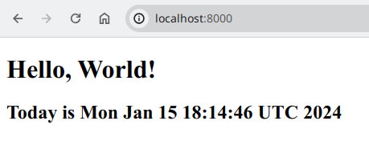

# Репозиторий для выполнения домашних заданий курса "Инфраструктурная платформа на основе Kubernetes-2023-12"

aasdhajkshd repository


> <span style="color:red">INFO</span>
<span style="color:blue">Информация на картинках, как IP адреса, порты или время, может отличаться от приводимой в тексте.</span>

---

## Содержание

* [Знакомство с Kubernetes, основные понятия и архитектура](#kubernetes-intro)

---

## <a name="kubernetes-intro">Знакомство с Kubernetes, основные понятия и архитектура</a>

### ДЗ // Знакомство с решениями для запуска локального Kubernetes кластера, создание первого pod

#### Выполнение

1. Создан файл манифест `kubernetes-intro/namespace.yaml`
2. Создан файл манифест `kubernetes-intro/pod.yaml`
3. Создание namespace *homework*:

```bash
$ kubectl create -f kubernetes-intro/namespace.yaml
namespace/homework created

$ kubectl get namespaces
NAME                   STATUS   AGE
default                Active   72m
homework               Active   20s
---
```

4. Применение манифестов:

```bash
$ kubectl apply -f kubernetes-intro/pod.yaml
configmap "nginx-config-homework" deleted
pod "web" deleted
configmap/nginx-config-homework created
pod/web created
```

5. Описание *pod'а*:

```bash
$ kubectl describe -n homework pod web
Name:             web
Namespace:        homework
Priority:         0
Service Account:  default
Node:             minikube/192.168.49.2
Start Time:       Mon, 15 Jan 2024 21:14:45 +0300
Labels:           app=nginx
                  component=homework
Annotations:      <none>
Status:           Running
IP:               10.244.0.9
IPs:
  IP:  10.244.0.9
Init Containers:
  install:
    Container ID:  docker://b1a094146a6b58ed6375f84893a0834b4e2aa48828fd5fc459d974db2a33b0d5
    Image:         busybox:1.28
    Image ID:      docker-pullable://busybox@sha256:141c253bc4c3fd0a201d32dc1f493bcf3fff003b6df416dea4f41046e0f37d47
    Port:          <none>
    Host Port:     <none>
    Command:
      /bin/sh
      -c
    Args:
      cat << EOF > /init/index.html
      <!DOCTYPE html><html lang="en"><head><title>Hello, World!</title></head><body><h1>Hello, World!</h1><h2>Today is $(date)</h2></body></html>
      EOF

    State:          Terminated
      Reason:       Completed
      Exit Code:    0
      Started:      Mon, 15 Jan 2024 21:14:46 +0300
      Finished:     Mon, 15 Jan 2024 21:14:46 +0300
    Ready:          True
    Restart Count:  0
    Environment:    <none>
    Mounts:
      /init from homework-volume (rw)
      /var/run/secrets/kubernetes.io/serviceaccount from kube-api-access-5mqzl (ro)
Containers:
  nginx:
    Container ID:  docker://3a8d1afc4e666be779e647200ea9092b4aa15c917dc2743821631c6bec472a27
    Image:         nginx
    Image ID:      docker-pullable://nginx@sha256:4c0fdaa8b6341bfdeca5f18f7837462c80cff90527ee35ef185571e1c327beac
    Port:          8000/TCP
    Host Port:     0/TCP
    Command:
      nginx-debug
      -g
      daemon off;
    State:          Running
      Started:      Mon, 15 Jan 2024 21:14:49 +0300
    Ready:          True
    Restart Count:  0
    Limits:
      cpu:     500m
      memory:  128Mi
    Requests:
      cpu:     500m
      memory:  128Mi
    Environment:
      NGINX_PORT:  8000
    Mounts:
      /etc/nginx/conf.d/homework.conf from nginx-config-volume (rw,path="homework.conf")
      /homework from homework-volume (rw)
      /var/run/secrets/kubernetes.io/serviceaccount from kube-api-access-5mqzl (ro)
Conditions:
  Type              Status
  Initialized       True
  Ready             True
  ContainersReady   True
  PodScheduled      True
Volumes:
  homework-volume:
    Type:       EmptyDir (a temporary directory that shares a pod's lifetime)
    Medium:
    SizeLimit:  <unset>
  nginx-config-volume:
    Type:      ConfigMap (a volume populated by a ConfigMap)
    Name:      nginx-config-homework
    Optional:  false
  kube-api-access-5mqzl:
    Type:                    Projected (a volume that contains injected data from multiple sources)
    TokenExpirationSeconds:  3607
    ConfigMapName:           kube-root-ca.crt
    ConfigMapOptional:       <nil>
    DownwardAPI:             true
QoS Class:                   Burstable
Node-Selectors:              <none>
Tolerations:                 node.kubernetes.io/not-ready:NoExecute op=Exists for 300s
                             node.kubernetes.io/unreachable:NoExecute op=Exists for 300s
Events:
  Type    Reason     Age    From               Message
  ----    ------     ----   ----               -------
  Normal  Scheduled  5m25s  default-scheduler  Successfully assigned homework/web to minikube
  Normal  Pulled     5m24s  kubelet            Container image "busybox:1.28" already present on machine
  Normal  Created    5m24s  kubelet            Created container install
  Normal  Started    5m24s  kubelet            Started container install
  Normal  Pulling    5m23s  kubelet            Pulling image "nginx"
  Normal  Pulled     5m21s  kubelet            Successfully pulled image "nginx" in 1.433760432s (1.433771463s including waiting)
  Normal  Created    5m21s  kubelet            Created container nginx
  Normal  Started    5m21s  kubelet            Started container nginx

```

6. Проверка:

```bash
$ kubectl exec -n homework -it web -- ls -Al
Defaulted container "nginx" out of: nginx, install (init)
total 4
-rw-r--r-- 1 root root 161 Jan 15 18:14 index.html

$ kubectl exec -n homework -it web -- cat /etc/nginx/conf.d/homework.conf
Defaulted container "nginx" out of: nginx, install (init)
server {
    listen 8000;
...

$ kubectl get pods -n homework -o wide
NAME   READY   STATUS    RESTARTS   AGE     IP           NODE       NOMINATED NODE   READINESS GATES
web    1/1     Running   0          2m22s   10.244.0.9   minikube   <none>           <none>

$ kubectl exec -n homework -it web -- curl http://localhost:8000
Defaulted container "nginx" out of: nginx, install (init)
<!DOCTYPE html><html lang="en"><head><title>Hello, World!</title></head><body><h1>Hello, World!</h1><h2>Today is Mon Jan 15 18:14:46 UTC 2024</h2></body></html>

$ kubectl port-forward -n homework pods/web 8000:8000
Forwarding from 127.0.0.1:8000 -> 8000
Handling connection for 8000
```



#### Полезные ссылки

- [Deploying Your First Nginx Pod](https://collabnix.github.io/kubelabs/pods101/deploy-your-first-nginx-pod.html)
